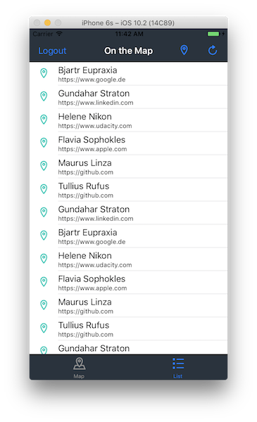

# udacity-ios-OnTheMap

OnTheMap is a project from the Udacity Course "iOS Networking with Swift":

https://www.udacity.com/course/ios-networking-with-swift--ud421

## Description

The app allows users to share their location and a URL with other students.
The data is visualized using a map with pins for locations and pin annotations
for student names and URLs. There is also a Table View to list the student 
names and links.

First, the user logs in to the app using their Udacity credentials. After login, 
the app downloads the locations and links previously posted by other students.

A user can post their own location and link. The locations are specified with a string 
and forward geocoded.

## Topics

* URL Escaping/Encoding
* NSURLComponents to construct URLs
* NSURLSession for network requests
* NSJSONSerializiation to parse JSON
* GCD and asynchronous network requests

## User Interface

### Login View

Allows the user to log in using their Udacity Credentials

### Map and Table Tabbed View

Allows the user to see the locations of other students in two formats

### Information Posting View

Allows the user to specify their own location and link

## API Keys

The necessary API Keys are **not** included in this repository.
